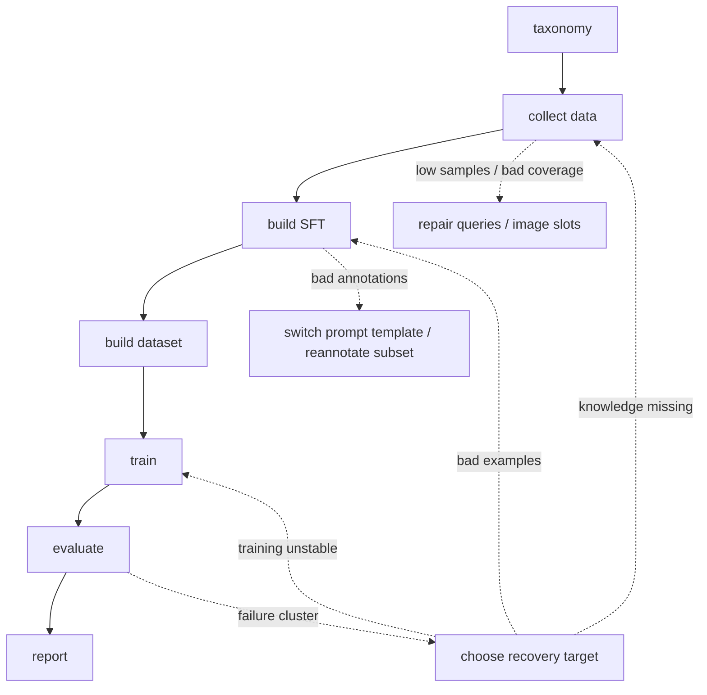

```mermaid
flowchart TD
  T["taxonomy"] --> C["collect data"]
  C --> S["build SFT"]
  S --> D["build dataset"]
  D --> R["train"]
  R --> E["evaluate"]
  E --> P["report"]

  C -. "low samples / bad coverage" .-> TQ["repair queries / image slots"]
  S -. "bad annotations" .-> SP["switch prompt template / reannotate subset"]
  E -. "failure cluster" .-> RX["choose recovery target"]
  RX -. "knowledge missing" .-> C
  RX -. "bad examples" .-> S
  RX -. "training unstable" .-> R

```